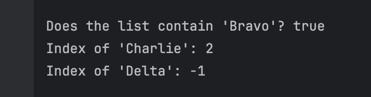

# Exploring Java Arraylist

**Name:** Andre Dominic Ha Lacra

---

## Output Screenshots and Explanations per Exercise

---

### Exercise 1: Creating an `ArrayList` and Adding Elements (`add`)

**Prediction**  
The output will first confirm that the list is empty (true). After adding three tasks, it will display the list contents ["Secure the perimeter", "Establish communication", "Report status"] and show that the number of tasks is 3.

**Observation**  
```
Is the list empty initially? true
Current tasks: [Secure the perimeter, Establish communication, Report status]
Number of tasks: 3
```

**Output Screenshot:**  


---

### Exercise 2: Accessing and Modifying Elements (`get` and `set`)

**Prediction**  
The output will show the item at index 1 as Map. The list before modification will be [Compass, Map, Radio]. After replacing the first item (Compass) with GPS, the list will be [GPS, Map, Radio].

**Observation**  
```
Item at index 1: Map
List before modification: [Compass, Map, Radio]
List after modification: [GPS, Map, Radio]
```

**Output Screenshot:**  


---

### Exercise 3: Inserting and Removing Elements (`add` at index and `remove`)

**Prediction**  
The output will show the list after insertion as [Primary Objective, Secondary Objective, Tertiary Objective]. Removing the item at index 2. d[Primary Objective, Secondary Objective]. After removing "Primary Objective" by object, the final list will be [Secondary Objective].

**Observation**  
```
List after insertion: [Primary Objective, Secondary Objective, Tertiary Objective]
Removed objective: Tertiary Objective
List after removing by index: [Primary Objective, Secondary Objective]
List after removing by object: [Secondary Objective]
```

**Output Screenshot:**  


---

### Exercise 4: Searching the List (`contains` and `indexOf`)

**Prediction**  
The output will indicate that the ArrayList contains "Bravo" by returning true from the contains() method. The indexOf() method will return 2 for "Charlie" since it is located at the third position (zero-based indexing). For "Delta", which is not present in the list, indexOf() will return -1, signaling that the element is absent.

**Observation**  
```
Does the list contain 'Bravo'? true
Index of 'Charlie': 2
Index of 'Delta': -1
```

**Output Screenshot:**  


---

### Exercise 5: Iterating Through the List

**Prediction**  
The output will first display each squad role using an enhanced for-loop, iterating directly over the elements without indexing. It will then display the same roles using a standard for-loop, where each iteration retrieves the element by its index using get(i), showing both the index and the role.

**Observation**  
```
--- Using an Enhanced For-Loop ---
Role: Leader
Role: Medic
Role: Engineer
Role: Scout

--- Using a Standard For-Loop with index ---
Role at index 0: Leader
Role at index 1: Medic
Role at index 2: Engineer
Role at index 3: Scout
```

**Output Screenshot:**  


---

### Exercise 6: Clearing the List (`clear`)

**Prediction**  
The output will show that the `ArrayList` initially contains two intel entries, with a size of `2`, and will print their contents. After calling `clear()`, the size becomes `0`, `isEmpty()` returns `true`, and the list prints as `[]`, indicating it is now empty.

**Observation**  
```
Intel count before mission: 2
Intel list: [Enemy position: Sector 4, Weakness: Power generator]

Intel count after mission: 0
Is the intel list empty now? true
Intel list: []
```

**Output Screenshot:**  


---
